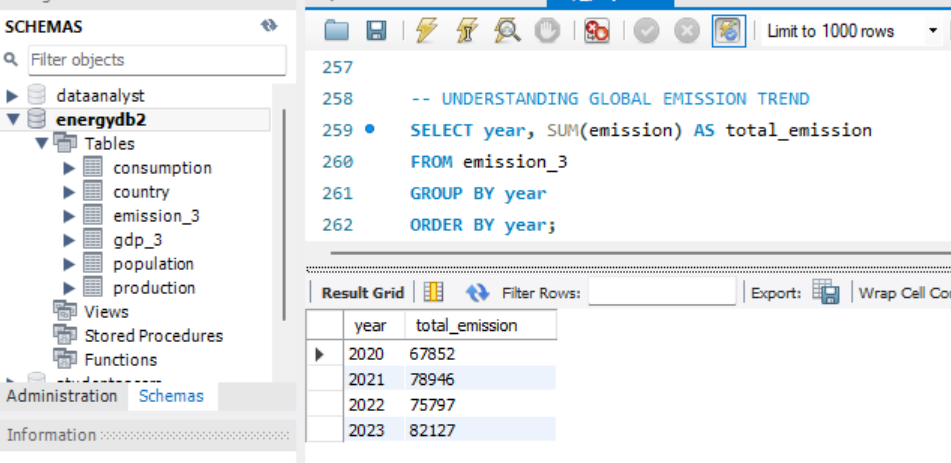
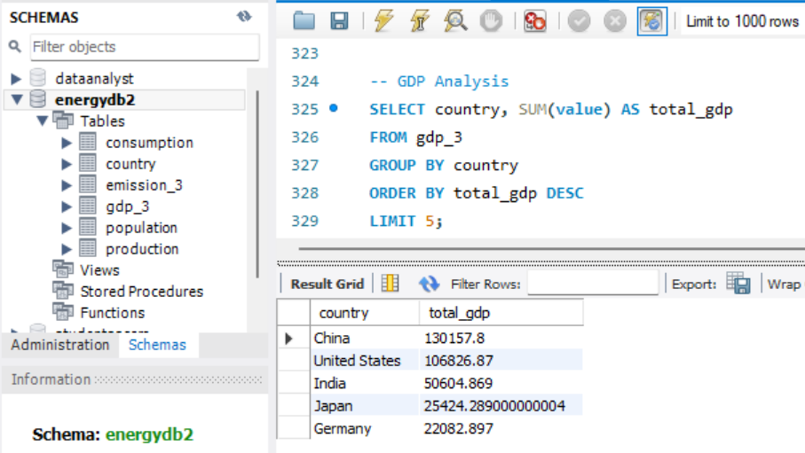
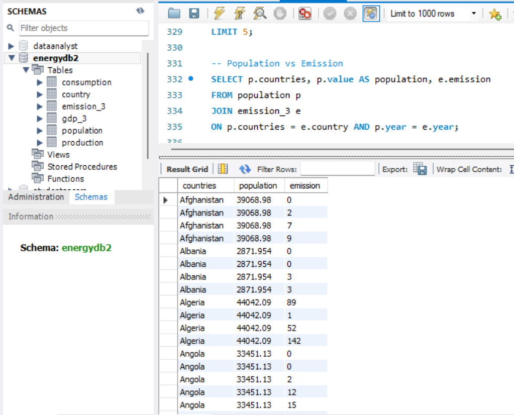

# 🌍 World Energy Consumption Analysis (SQL Project)

## 📌 Project Overview

This project analyzes **global energy consumption, emissions, GDP, and population trends** using SQL.

The dataset is based on real-world data from energy tracking organizations, enabling insights into:

* Energy production vs consumption
* Economic growth vs environmental impact
* Population influence on emissions

---

## 🎯 Objectives

* Analyze global energy trends across countries
* Compare GDP, emissions, and population growth
* Identify top contributors to emissions
* Derive meaningful insights using SQL queries

---

## 🗂️ Dataset Description

The project uses 6 structured tables:

* `country`
* `emission`
* `consumption`
* `production`
* `gdp`
* `population`

📄 Based on project documentation 

---

## 🧠 Key Analysis Performed

### 🔹 General Analysis

* Total emissions per country
* Top 5 countries by GDP
* Production vs consumption comparison

### 🔹 Trend Analysis

* Emission trends over years
* GDP growth patterns
* Population vs emission relationship

### 🔹 Ratio Analysis

* Emission to GDP ratio
* Per capita consumption

### 🔹 Global Insights

* Top emitting countries
* Global averages of GDP, emissions, and population

---

## 🛠️ Tech Stack

* SQL (MySQL)
* Excel (Data preprocessing)
* PowerPoint (Presentation)

---

## 📊 Sample SQL Query

```sql
SELECT country, SUM(emission) AS total_emission
FROM emission_3
GROUP BY country
ORDER BY total_emission DESC;
```

---

## 📸 Project Screenshots

### Emission Trend Analysis



### GDP Analysis



### Population vs Emission



---

## 📈 Key Insights

* Countries with high GDP often show higher emissions
* Population growth has a strong correlation with energy consumption
* Some countries improved efficiency by reducing emissions per capita

---

## 📁 How to Run

1. Import CSV files into MySQL
2. Run `schema.sql` to create tables
3. Execute queries from `queries.sql`

---

## 👤 About Me

**Sharanya**
🎓 B.Sc Data Science Graduate (2025)
📊 Aspiring Data Analyst

---

## ⭐ Why This Project Matters

This project demonstrates:

* Strong SQL skills
* Real-world data analysis
* Business & environmental insights

---

## 📬 Contact

Feel free to connect with me on LinkedIn!

---

⭐ *If you like this project, give it a star!*
